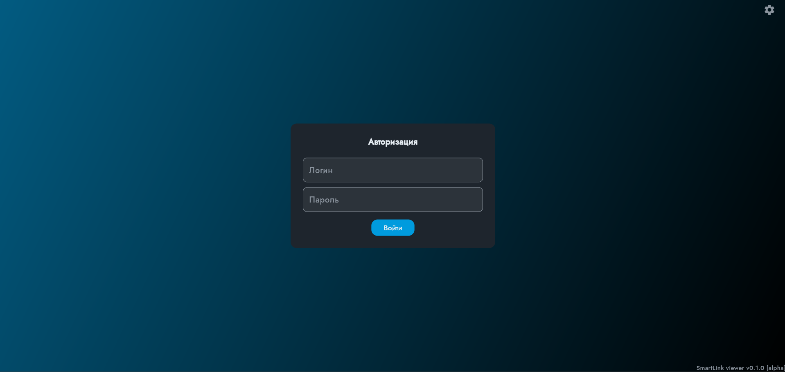
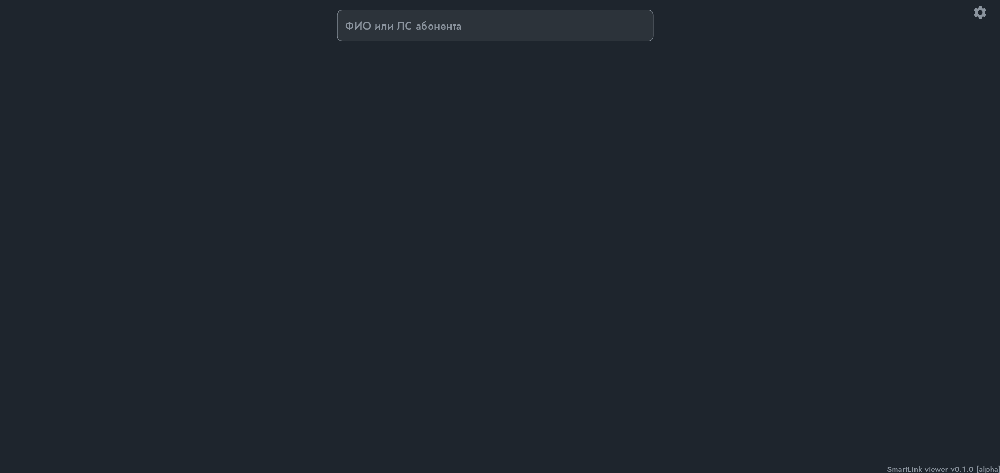
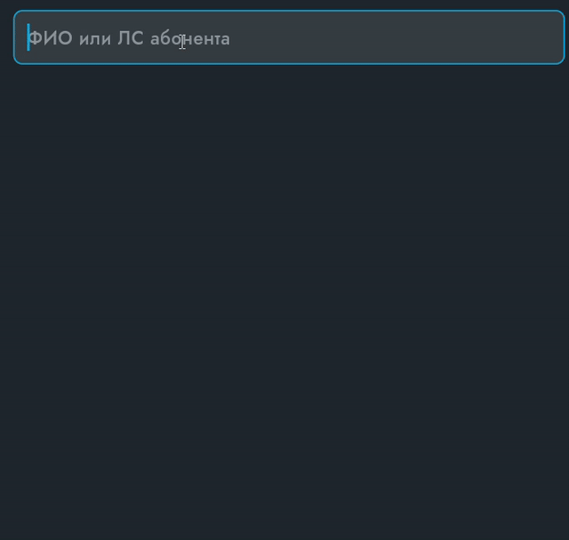
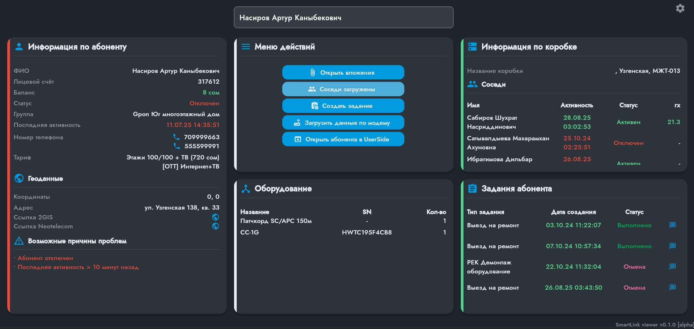
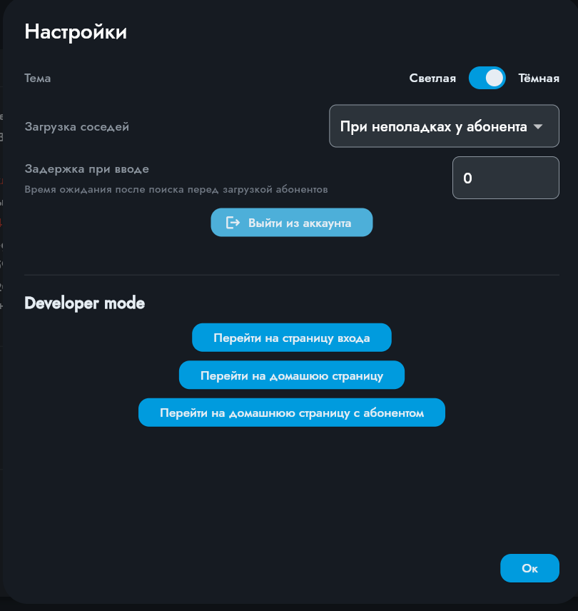

# smartlink

Софт для операторов компании Neotelecom. Разработан на языке `Dart` + `Flutter`. Пока доступна только [web](192.168.2.112) версия.
> Сайт находится на стадии Beta разработки, и может содрежать ошибки\баги.

## План

...
 - [x] Запуск бета-теста
 - [x] Отдельный диалог для задания
 - [ ] Переделать диалог вложений чтобы он был кроссплатформенным и не использовал устаревший `dart:html`
 - [ ] Изменить вид иконки чата
 - [ ] Переделать чат

...

## Использование
### 1. Вход

Введите ваш логин и пароль (как в _UserSide_). Нажмите кнопку "Войти". После входа вас перебросит на главную страницу.

### 2. Поиск абонентов

Введите ФИО или лицевой счет абонента для поиска. После завершения выберите нужного абонента из появившегося списка. Либо нажмите Enter, чтобы выбрать первого абонента из списка.


### 3. Информация

После выбора абонента появляется вся собранная информация по абоненту из _UserSide_. Здесь есть данные абонента, коробки, оборудование и задания (в будущих версиях список может пополняться).
#### Информация по абоненту
Слева вы можете увидите контейнер с иформацией об абоненте, его геоданные - координаты, адрес (если есть), и возможные причины проблем. Для открытия ссылок, нажмите на значок глобуса напротив поля.
##### Возможные причины проблем
Система SmartLink автоматически определят возможные причины неполадок у абонента. Полный список причины (может пополняться):
 - Низкий уровень сигнала (`onu_level` < -25)
 - Абонент отключен (Статус = `Отключен`)
 - Абонент на паузе (Статус = `Пауза`)
 - Последняя активность > 10 минут назад (`last_activity` > 10 минут)
 - Проблемы в коробке (Последняя активность всех соседей > 10 минут)
#### Меню действий
В середине сверху вы можете увидеть контейнер с кнопками. Это доступные действия.
 - **Открыть вложения:** открыть вложения абонента и задания (см. [использование диалога "Вложения"](#использование))
 - **Загрузить соседей:** загрузить список соседей (если не загружен). Если список уже загружен, показывается сообщение "Соседи уже загружены"
 - **Создать задание:** создать задания на абонента. Доступны типы "Ремонт" и "Магистральный ремонт" (см. [использование диалога "Создание задания"](#использование))
 - **Загрузить данные по модему:** Загрузить данные по ONT/Модему
 - **Открыть абонента в UserSide:** Перейти в _UserSide_ и открыть карточку абонента.
#### Оборудование
В середине снизу вы можете увидеть список оборудования абонента. Доступные параметры: Название, SN (Серийный номер), и количество.
#### Информация по коробке
Справа сверху вы можете увидеть список соседей и навзание коробки (может не быть, для переключения отображения см. [настройки отображения соседей](#настройки)). Если у абонента нет коробки, будет показано сообщение "Коробка не найдена".
> Предупреждение: "rx" (`onu_level`) у соседей отображен в положительном значении  и округлено до 1 числа после запятой (пример: `25.7`, хотя оригинальное значение `-25.78`). Это используется для умменьшения места для поля rx в пользу имени.

Отображаемые поля у соседей: ФИО, последняя активность, статус и `rx` (уровень сигнала)
#### Задания абонента
Снизу справа вы можете увидеть задания абонента. Если их нет, вы увидите "У абонента нет заданий". Отображаемые поля: Тип задания, дата создания и статус. Чтобы открыть подробную информацию о задании, нажмите на иконку справа от задания (см. [использование диалога задания](#использование)).
### 4. Диалоговые окна
Помимо основных страниц, в SmartLink есть диалоговые окна. Они используется для открытия доп. инофрмации, например комментарии\вложения.
#### Настройки

Диалог настроек используется дла настройки сайта. Настройки сохраняются только лично у вас на компьютере, других пользователей это не затрагивает.
Доступные параметры:
 - **Тема:** изменение темы сайта. _Пока в разработке_
 - **Загрузка соседей:** в каком случае стоит загружать соседей. Доступные значения: Никогда, При неполадках у абонента (статус = отключен или активность > 10 мин. назад) и Всегда. Вы все еще сможете вручную загружать соседей кнопкой "Загрузить соседей" в меню действий.
 - **Заддержка при вводе (debounce):** Задержда после ввода ФИО\ЛС абонента перед обработкой. Используется для того чтобы не нагружать сервер и снизить риск ошибочной загрузки (при быстрой печати первый запрос может отобразится после второго). Рекомендуется ставить значения между 50 и 1000. По умолчанию - 300
 - **Выйти из аккаунта:** Выход из аккаунта (Редко используется)
 - **Developer mode** используется для отладки\теста сайта. Не рекомендуется к использование. Будет удалено в beta версии.

## Запуск
Для запуска необходим работающий сервер [SmartLinkAPI](https://github.com/firedotguy/smartlinkAPI) и установленные `Flutter` версии 3.32.0 и `Dart` версии 3.8.0+.
Укажите хост и апи ключ сервра в конфиге .env:
```
API_BASE="http://host:port"
API_KEY="server api key"
```
Запустить сайт в debug режиме:
```bash
./scripts/dev.ps1
```
Создать и обновить сайт:
```bash
./scripts/prod.sh
```
> Копирование сайта идет в папку /var/www/flutter.
